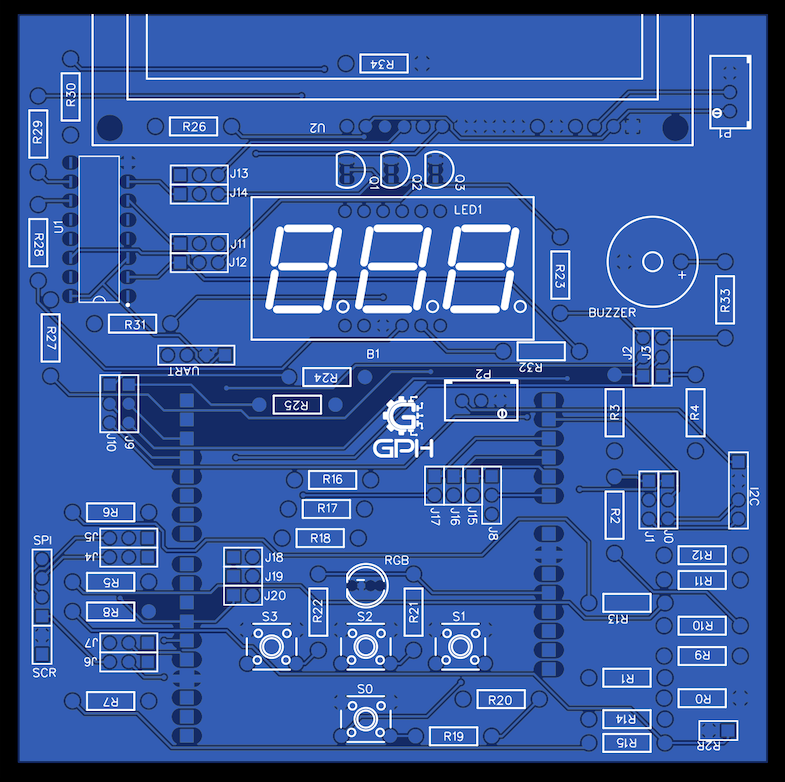
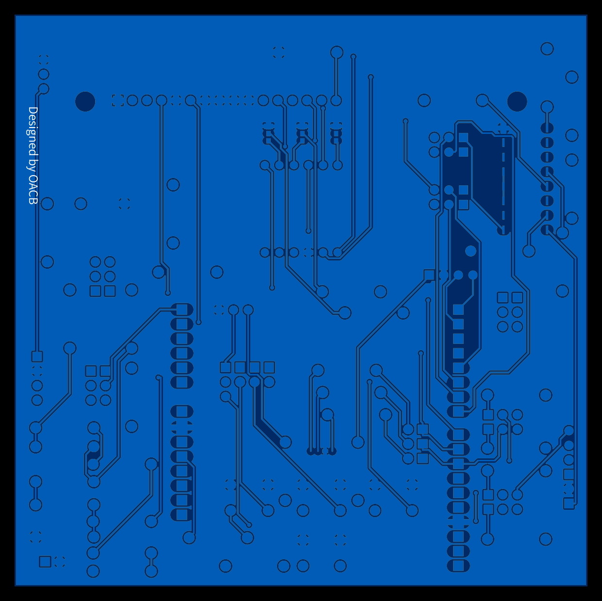

# uC-MicroLab Shield

Open Hardware shield for integrating diverse microcontroller boards (Arduino, STM32, etc.), providing standardized communication interfaces (I2C, SPI, UART) and modular expansion.

Note: The board follows the Arduino R3 header standard. Actual pin assignments and voltage levels depend on the host board you use.

<p align="center">
  
  
</p>

## Project Status
- Current Hardware Revision: **r1** (stable)
- Next Planned Revision: r1.1 (mechanical tweaks and improved decoupling)
- Firmware/Drivers: early stage; no tested examples published yet

## Key Features
- Compatible with multiple host boards
- Interfaces: I2C, SPI, UART
- Extra pads for expansion
- 3D model and fabrication package provided
- Licensed under CERN-OHL-W v2 (hardware) and MIT (firmware/examples)

## Compatibility
- Physical and signal mapping follows the Arduino R3 header standard.
- Electrical levels and specific pin functions depend on your host board.
- See [docs/overview.md](docs/overview.md) for compatibility notes.

## Repository Structure (Summary)

```
hardware/         → PCB revisions (r1, r1.1, …) and fabrication artifacts
firmware/         → Reusable code and per‑platform adaptations
examples/         → Example projects (to be added)
docs/             → Technical docs, pinout notes, API, compliance
```

## Getting Started

1. Clone the repository:
   ```bash
   git clone https://github.com/otavioacb/uC-MicroLab.git
   ```
2. Open the desired hardware revision:
   ```bash
   cd uC-MicroLab/hardware/r1
   ```
3. Review the fabrication bundle in `fabrication_bundle/` for manufacturing.

Examples are not yet available. They will be added once validated on real hardware.

## Pinout (Summary)

Full pinout and mechanical details: [docs/hardware/r1/uc-schematic-r1.pdf](docs/hardware/r1/uc-schematic-r1.pdf)

## Examples

No tested examples are published yet. 

## Contributing

See [CONTRIBUTING.md](CONTRIBUTING.md) for:
- Hardware change workflow (issue → PR → new revision)
- Commit conventions (Conventional Commits)
- Coding style and testing guidelines

## Roadmap (Summary)

- r1.1: Silkscreen adjustments; improve USB‑area clearance
- r2: Add CAN interface + partial isolation
- Firmware 1.1.0: Host board auto‑detection abstraction

## Licenses

- Hardware: CERN OHL‑W v2  
- Firmware / Examples: MIT  
See [LICENSE](LICENSE) and per‑revision notices at `hardware/Rx/compliance/license-notice.txt`.

## Attribution

If you reuse this design, keep the license notice and reference to the original repository.

## Contact

- Author/Maintainer: Otávio ([@otavioacb](https://github.com/otavioacb))
- Issues: please use the appropriate template under “New Issue”


